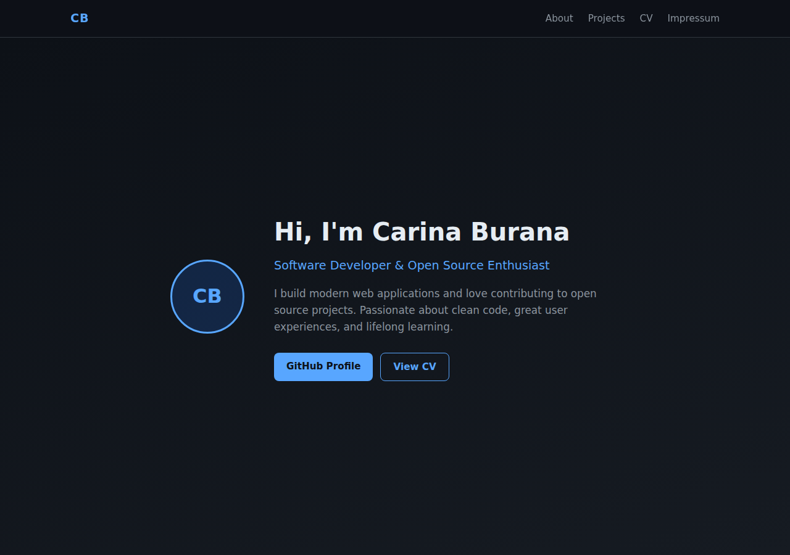
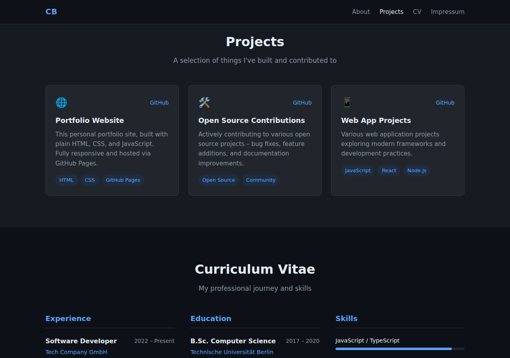
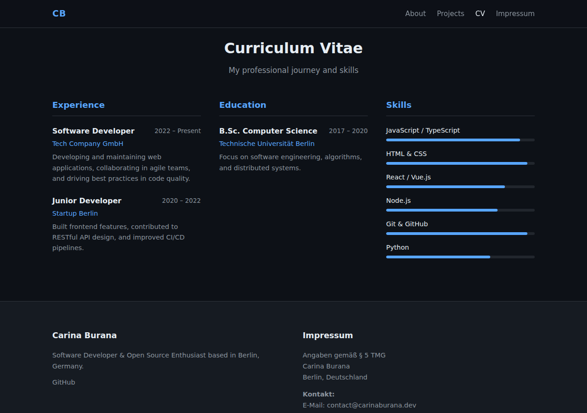
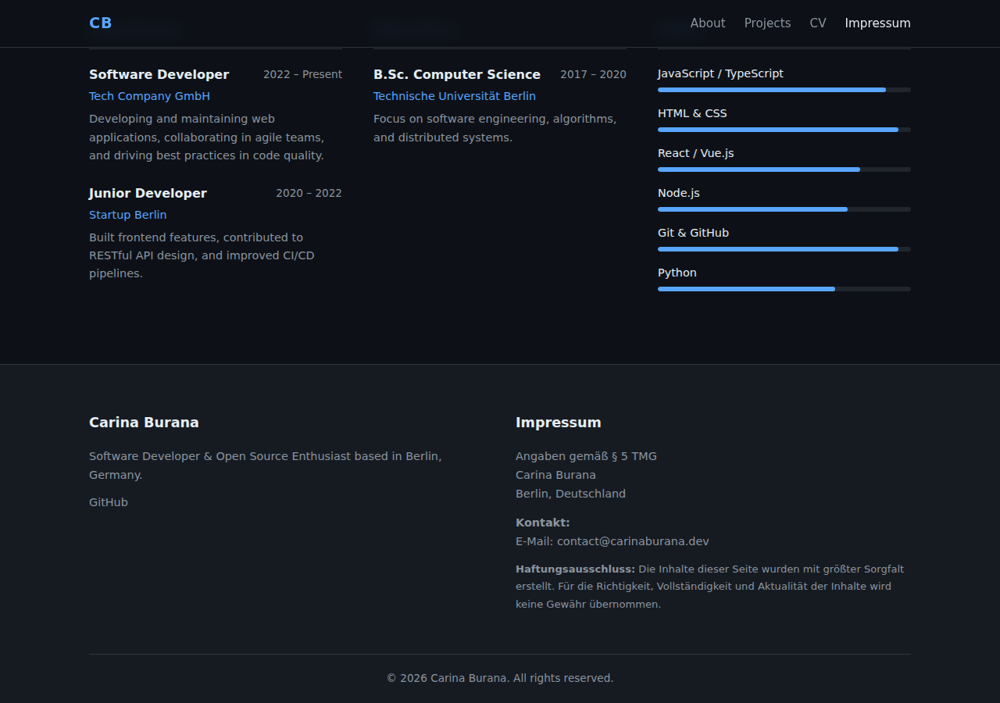

# carinaburana.github.io

Personal portfolio website for Carina Burana, hosted via [GitHub Pages](https://carinaburana.github.io).

## Features

- **About** – Introduction and a quick overview of who I am
- **Projects** – Highlighted personal and open-source projects
- **CV** – Work experience, education, and skills
- **Footer / Impressum** – Contact information and legal notice

## Screenshots

### About / Hero



### Projects



### CV



### Footer & Impressum



## Tech Stack

- Plain HTML5 & CSS3 (no frameworks)
- Hosted via [GitHub Pages](https://pages.github.com/)

## Local Development

```bash
# Serve locally with Python
python3 -m http.server 8080
# Then open http://localhost:8080
```